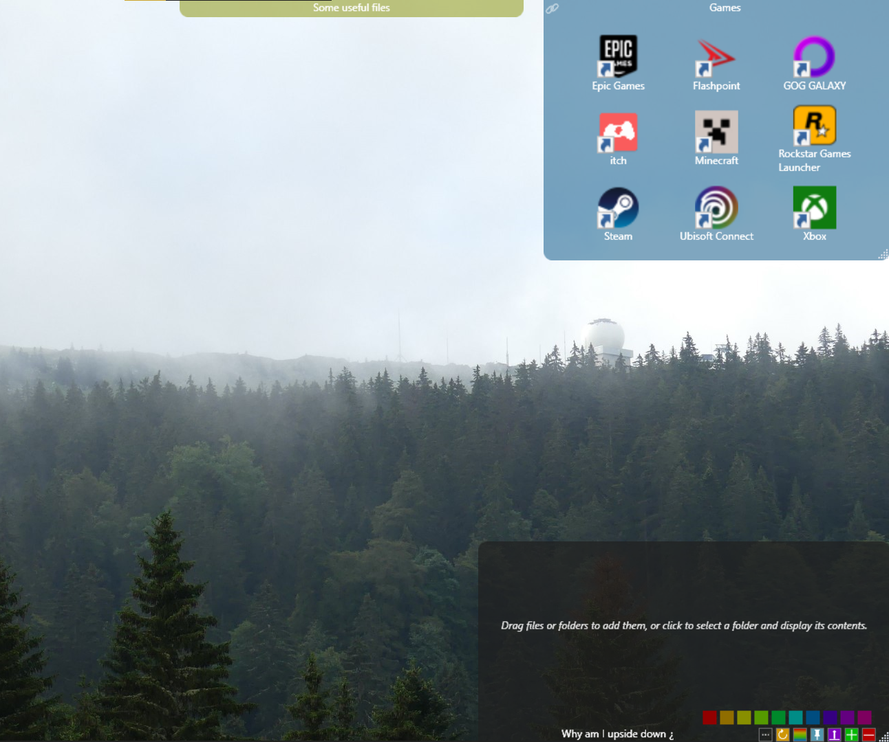

# Desktop Container

## A WPF app inspired by [Fences](https://www.stardock.com/products/fences/)

## Features
➕ Create *Container* and add any files/folder you want with drag & drop

🔤 Name the Container, move it, and resize it as you like

💾 Containers content and property are automatically saved (`%AppData%\DesktopContainer\`), when an empty Container is closed the save file is deleted

📌 You can pin any Container to keep it in front of other windows

↔️ You can reorganize and delete Container's item by right clicking them

## Know issues ⚠️
- The Containers don't always stay on the desktop

- ✔️ ~~Custom folder icons are not supported~~
- ✔️ ~~Unable to scroll if items are overflowing~~
